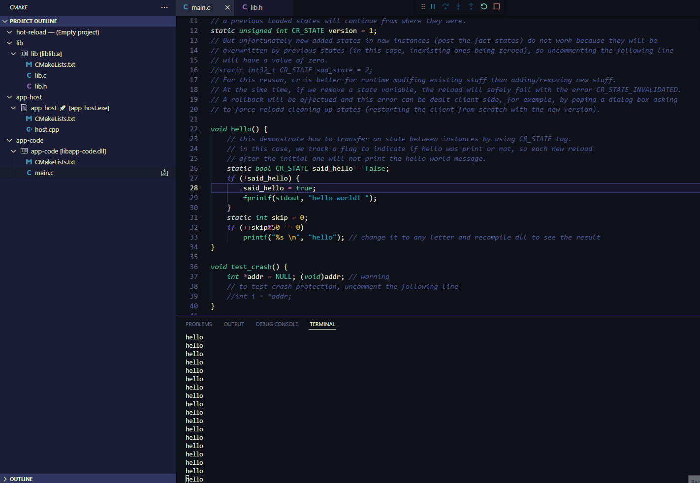

# hot-reloading-sample

This sample demosntrates usage of cr.h hot reloading header-only library. The primary goal of it is to increase iteration speed and bring quality of development.
In this repository you may find both hot reloadable lib.dll and app.dll which allows you to develop both core library and sample application with the abillity to hot reload. 

## In action

